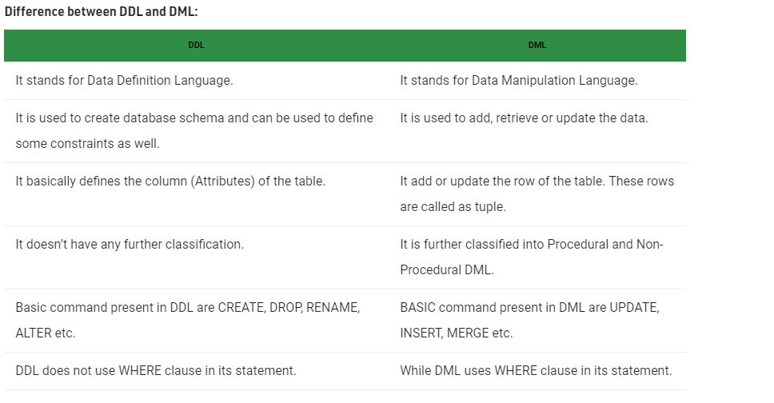
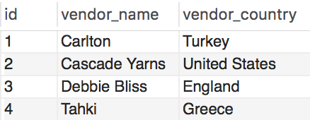

# DML & DDL

## Part 1

* What is the difference between `DML` and `DDL` in SQL?
### Answer

 

Source: https://www.geeksforgeeks.org/difference-between-ddl-and-dml-in-dbms/
## Part 2

* Demonstrate a use of `DML` in the following table:

  * vendor_table
    

### Answer
`UPDATE table_name`
`SET vendor_name = 'Meakin'`
`WHERE id = 1`