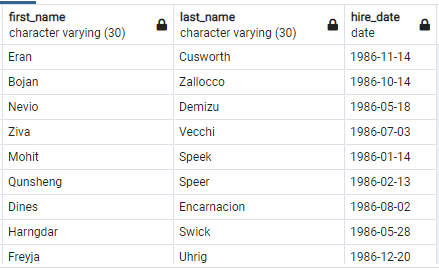
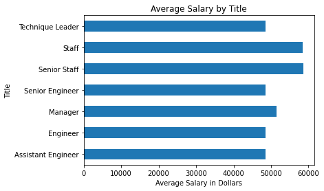

# SQL Homework - Employee Database: A Mystery in Two Parts

## Key take aways

1. The database is a fake employee database because the employee ID number 499942 returns a fake record

2. Employees with titles Staff and senior staff are the most paid 

3. The majority of employees earn between $40000 and $50000.

4. Intrestingly in this database males and females earn the same average salary

### Tables of Query Results

#### Data Analysis

1. List the following details of each employee: employee number, last name, first name, sex, and salary.

 

2. List first name, last name, and hire date for employees who were hired in 1986.

3. List the manager of each department with the following information: department number, department name, the manager's employee number, last name, first name.

4. List the department of each employee with the following information: employee number, last name, first name, and department name.

5. List first name, last name, and sex for employees whose first name is "Hercules" and last names begin with "B."

6. List all employees in the Sales department, including their employee number, last name, first name, and department name.

7. List all employees in the Sales and Development departments, including their employee number, last name, first name, and department name.

8. In descending order, list the frequency count of employee last names, i.e., how many employees share each last name.

## Bonus

1. Creating a histogram to visualize the most common salary ranges for employees.

2. Creating a bar chart of average salary by title.

3. Does the company practice fair wage? (personal question)
 Yes

## The fake record

## Database Design

### Copyright

Trilogy Education Services © 2019. All Rights Reserved.
